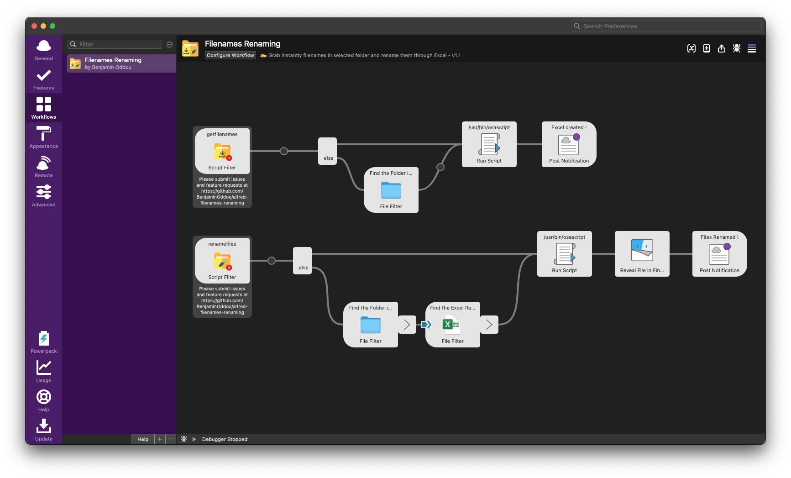

Welcome to the Filenames Renaming repository: **An Alfred Workflowk** ✨

## ✅ Prerequisite

-  MacOS
-  Alfred 5. Note that the [Alfred Powerpack](https://www.alfredapp.com/powerpack/) is required to use workflows.
-  Microsoft Excel

## ⬇️ Installation

1. [Download the workflow](https://github.com/BenjaminOddou/alfred-filenames-renaming/releases/latest)
2. Double click the `.alfredworkflow` file to install

## 📖 Documentation

> 🚨 **Important** 
> 
> This workflow doesn't convert files so take care to preserve original filename extensions

> 💡 **Recommended**
>
> Show filename extensions on Mac (See [Documentation](https://support.apple.com/en-ie/guide/mac-help/mchlp2304/mac) from Apple)
> 
> - In the Finder  on your Mac, choose *Finder > Preferences*, then click *Advanced*.
> - Select *Show all filename extensions*.

### 1. Get all filenames of a selected folder in an Excel file

> Trigger: `getfilenames`

1. Launch the script with the trigger `getfilenames` and press ↩
2. Select the folder with files you want to grab the names of

### 2. Rename files of a selected folder from an Excel sheet

> Trigger: `renamefiles`

1. In the Excel file created with the first script, input new names in Column B. 
    > 🚨 **Important** : Don't forget filename extensions. 
    > 
    > 💡 **Recommended** : You can use a formula like `="filename"&C1` in `B1` cell to incorporate filename extensions
2. Save your file on your machine with ⌘S or ⌘⇧S
3. Launch the workflow with the trigger `renamefiles`
4. Select the folder with files to rename
5. Select the Excel file with old and new names

## ⚖️ License

[MIT License](LICENSE) © Benjamin Oddou