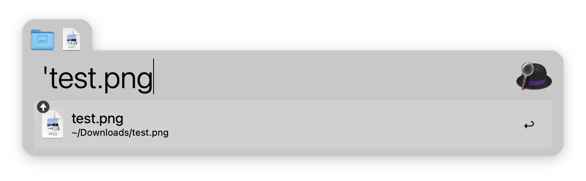
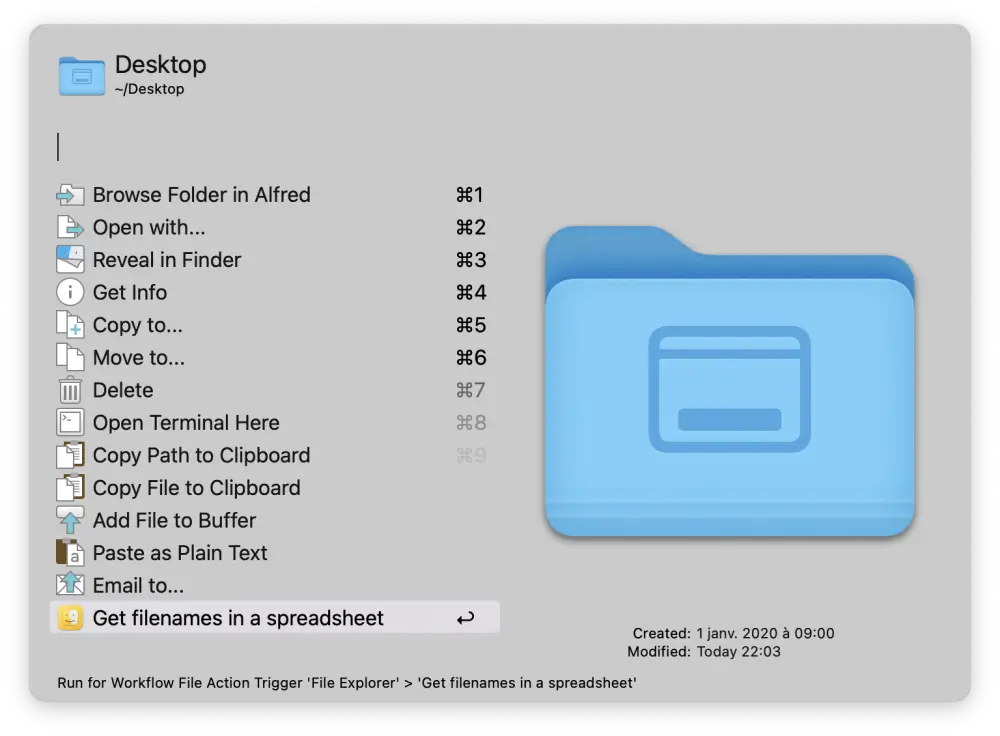
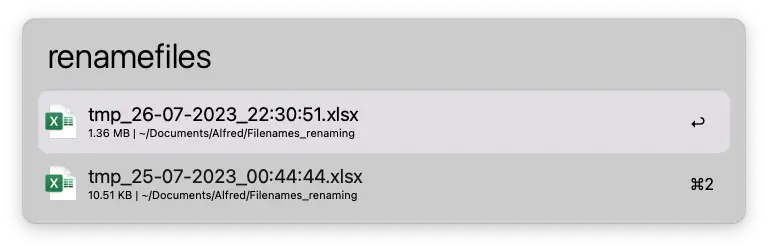
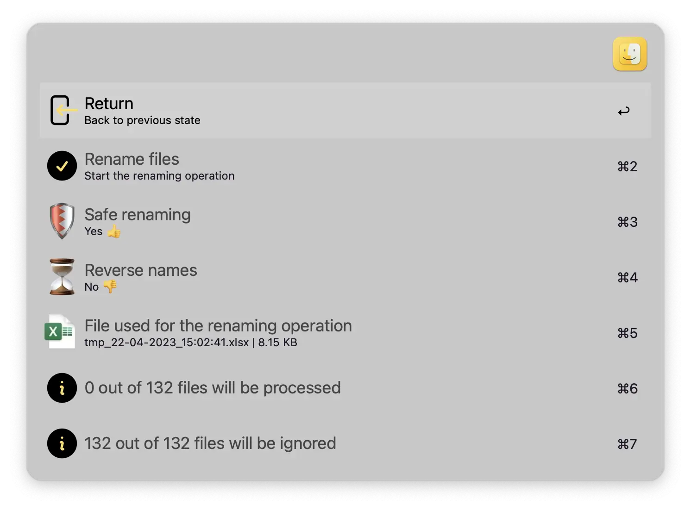

[](https://github.com/BenjaminOddou)
[](https://saythanks.io/to/BenjaminOddou)
[](https://www.python.org/downloads/macos/)

Welcome to the File Explorer repository: **An Alfred Workflow** ✨

## ✅ Prerequisites

* MacOS.
* Alfred 5. Note that the [Alfred Powerpack](https://www.alfredapp.com/powerpack/) is required to use workflows.
* Any spreadsheet software which can open `.xlsx` files like [Microsoft Excel](https://apps.apple.com/fr/app/microsoft-excel/id462058435?mt=12), [Numbers](https://apps.apple.com/us/app/numbers/id409203825?mt=12), [WPSOffice](https://apps.apple.com/fr/app/wps-office-pdf-docs-sheets/id1468073139?mt=12), [LibreOffice](https://www.libreoffice.org/download/download-libreoffice/)...
* Requires **python 3.6** or above.

## ⬇️ Installation

1. [Download the workflow](https://github.com/BenjaminOddou/alfred-file-explorer/releases/latest)
2. Double click the `.alfredworkflow` file to install

## 🧙‍♂️ Invoke the workflow

There is 2 flows in this workflow :

1. The first one allows you to grab filenames. It can be triggered by writing `getfilenames` keyword.
2. The second allows you to rename files based on the data in a selected spreadsheet. You can invoke this flow with the `renamefiles` keyword.

You can edit these triggers (flagged with a `🕹️` symbol) in the user configuration panel.

## 🧰 Setup the workflow

1. Install Python 3.6 or above. Check your version with :

```shell
python --version
```

## 🤖 Usage of the workflow

### Register filenames in a Spreadsheet

Ensure that you select the right Level for the parameter `🔍 Depth of the search`. If you want to include files in subdirectories increase the depth level.

Optionally, you can write a regex expression to the `🚫 Reject Files` parameter. If the files matches you regex parameter, it will be excluded from the result. For example the following regex expression `^\.|^\~|desktop\.ini` will allow you to exclude common hidden and temp files.

> Note that if you let it empty, all files will be listed

#### Using Workflow File Filter

Invoke the first flow with the `🕹️ Trigger 1` and search for the folder or the file you want to register the filenames of and press ⏎.


Alternatively, use the `Alfred Buffer` to select folder(s) and files(s) at the same time !! Basic commands are :

* ⌥↑ to add a file to the buffer from Alfred's results.
* ⌥↓ to add a file and move to the next item in your list of results.
* ⌥← to remove the last item from the buffer.
* ⌥→ to action all items in the buffer.
* ⌥⌫ to remove all items from the buffer.

To know more on how to use `Alfred Buffer`, follow this [link](https://www.alfredapp.com/help/features/file-search/#file-buffer).

> Note that `Alfred Buffer` is preferred compare to the `{query}`, meaning that if you select a folder/file (by clicking on it or by pressing enter ⏎) that is not included in the buffer, **it will not be included in the xlsx file**.



#### Using Alfred Universal Actions

Select the folder(s) / files(s) you want to grab the name of within alfred using `Quick Search` and run `Universal Actions` with → or ⌥→ if you used the `Alfred buffer`. Select "Get filenames in a spreadsheet".



If you want to know more on how to use Alfred Universal Actions, follow this [link](https://www.alfredapp.com/help/features/universal-actions/).

### Renaming files

Edit the **column D** of the xlsx generated file with new filenames and **include file extension**. Please, don't insert, delete, or edit any other columns.

> Note that changing a file extension (png to jpg for example) can potentially break the file ! You can prevent this by setting the `🛡️ Safe renaming` parameter to `True 👍`. If you still want to change the file extension (jpg to JPEG for example), set the value to `False 👎`.

Invoke the second flow with the `🕹️ Trigger 2` and select the xlsx file that should be used for the renaming operation and press ⏎. Hold the ⌘ key and press ⏎ to reveal the file in the finder. Alternatively you can open the file in the default application by pressing ⌥⏎.



Review your parameters and launch the renaming operation by selecting `Rename Files`.

> Note that if you want to change back from new names (in column D) to old names (columns B+C), you can set up the `🌊 Workflow renaming direction` parameter to `Reversed 👈`. Otherwise let it to `Normal 👉`.



#### Logs output

Check the logs of your compression under the `Data folder`. The log file can contains two types of messages : 

1. If everything went well you'll have the following message : `INFO:root:✅ Renaming successful: {old_file} ⇒ {new_file}`
2. If an error occurs, you'll have : `INFO:root:🚨 Error renaming {old_file}: {error_description}`

> Note that renaming operation will always create a log file that is named `{name_of_the_excel_file}{log_timestamp}.log`

## ⚖️ License

[MIT License](LICENSE) © Benjamin Oddou
